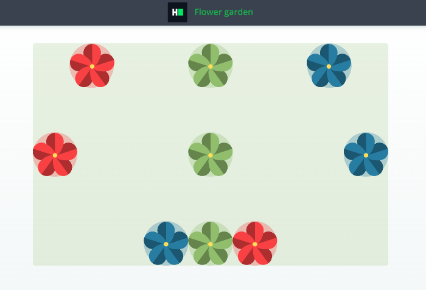

# CSS: Flex Flower Garden
Complete a partially completed application. Complete the application shown below using flex CSS rules in order to pass all the unit tests.

## Environment 

- Node Version: ^12.18.3
- Default Port: 8000

## Application Demo:


## Application description

Complete a flower garden application with the following UI:

Your garden contains 3 rows with 3 flowers each, total 9 flowers.
Position 9 flowers in the garden the way described below:
- Garden should use `flex` display
- Every garden row should use `flex` display
- Every flower in the garden should be located exactly on the top of the circle of the corresponding color

All the markup for the question has been added. As a candidate, you have to complete the CSS file to implement the above-stated features.

## Project Specifications

**Read Only Files**
- `test/*`
- `src/index.js`
- `src/index.html`
- `src/css/readonly.css`
- `app.js`

**Commands**
- run: 
```bash
bash bin/env_setup && . $HOME/.nvm/nvm.sh && npm start
```
- install: 
```bash
bash bin/env_setup && . $HOME/.nvm/nvm.sh && npm install
```
- test: 
```bash
bash bin/env_setup && . $HOME/.nvm/nvm.sh && npm test
```
